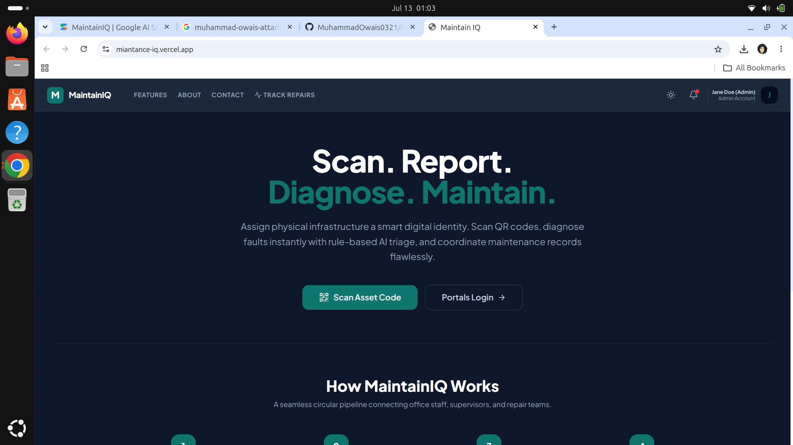
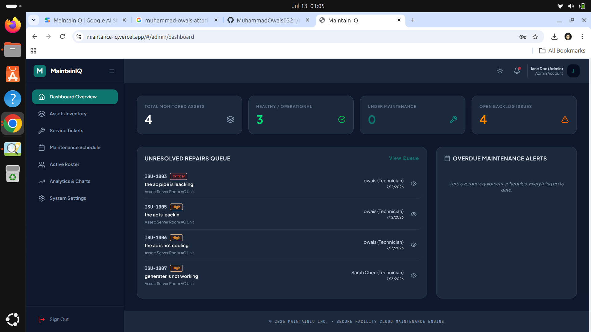
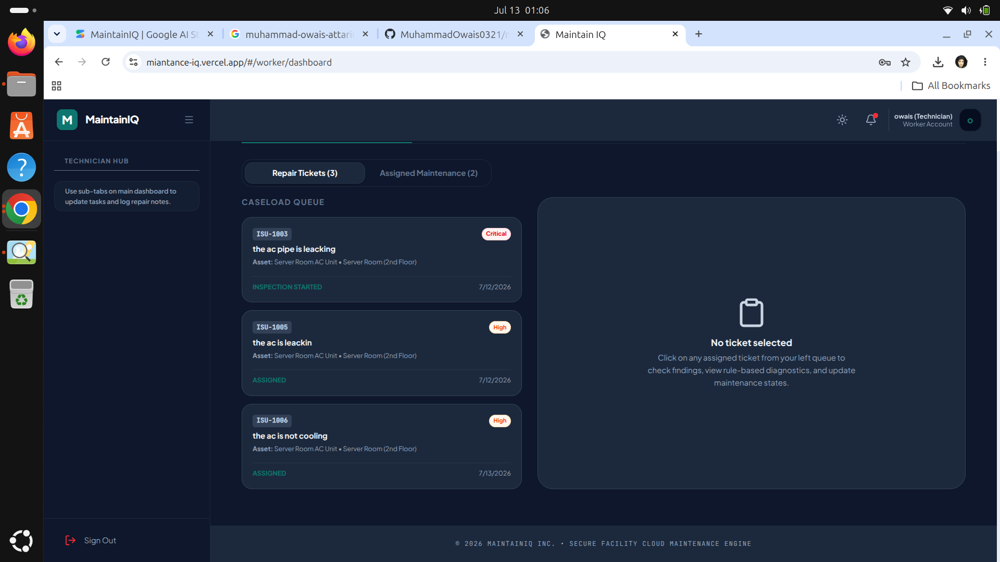

# MaintainIQ

**AI-Powered QR Maintenance & Asset History Platform**

MaintainIQ is a role-based facility maintenance management system. Assets are tagged with QR codes so anyone can scan and report an issue on the spot, technicians manage and resolve work orders from a dedicated dashboard, and admins get full visibility into assets, issues, workers, and analytics — all from a single web app.

## Screenshots

> Add your screenshots to a `screenshots/` folder in the repo root, then update the image paths below.

| Public QR Report Page | Admin Dashboard |
|---|---|
|  |  |

| Worker Dashboard | 
|---|
|  | 

## Features

- **QR-Based Asset Reporting** — Generate and print QR codes for physical assets; scanning one opens a public issue-reporting page for that asset.
- **Smart Issue Triage** — Reported issues are auto-analyzed (category, priority, likely causes, and initial checks) using a built-in rules engine, with hazard keyword detection for urgent cases like gas leaks or exposed wiring.
- **Role-Based Portals**
  - **Admin Dashboard** — Manage assets, issues, workers, maintenance schedules, and view analytics/charts.
  - **Worker Dashboard** — View assigned issues, log inspections, record parts used and cost, and update asset condition.
  - **Public Portal** — Report issues anonymously via QR scan and track issue status with an issue number.
- **Full Asset History** — Every action (creation, issue reports, assignments, resolutions) is logged against the asset for a complete maintenance timeline.
- **Notifications** — In-app alerts for admins and workers on new issues, assignments, and status changes.
- **Maintenance Scheduling** — Plan and assign preventive maintenance tasks with due dates and priorities.
- **Stats & Charts** — Visual breakdowns of issues, asset conditions, and technician performance.

## Tech Stack

- **Frontend:** React 19 + TypeScript
- **Build Tool:** Vite 6
- **Styling:** Tailwind CSS 4
- **Charts:** Recharts
- **Icons:** Lucide React
- **Animation:** Motion
- **QR Codes:** qrcode
- **AI/Backend Ready:** Google Gemini SDK (`@google/genai`), Express

## Project Structure

```
miantanceIQ/
├── src/
│   ├── App.tsx                # Root component & routing
│   ├── main.tsx                # App entry point
│   ├── types.ts                 # Shared TypeScript types (User, Asset, Issue, etc.)
│   ├── index.css                # Global styles (Tailwind)
│   ├── components/
│   │   ├── QRGenerator.tsx      # QR code generation for assets
│   │   └── StatsCharts.tsx      # Dashboard analytics/charts
│   ├── utils/
│   │   ├── ai.ts                # Smart issue triage / rules engine
│   │   └── db.ts                # Local data layer (mock DB)
│   └── views/
│       ├── AdminDashboard.tsx   # Admin portal
│       ├── AdminWorkers.tsx     # Worker management (admin)
│       ├── WorkerDashboard.tsx  # Technician/worker portal
│       ├── LoginSignup.tsx      # Auth screens for all roles
│       ├── PublicHome.tsx       # Public landing page
│       ├── PublicAssetView.tsx  # Public asset/issue reporting via QR
│       └── TrackIssueView.tsx   # Public issue tracking
├── index.html
├── vite.config.ts
├── tsconfig.json
├── package.json
└── metadata.json
```

## Getting Started

### Prerequisites

- [Node.js](https://nodejs.org/) (v18 or later recommended)
- npm

### Installation

```bash
git clone https://github.com/MuhammadOwais0321/miantanceIQ.git
cd miantanceIQ
npm install
```

### Run in Development

```bash
npm run dev
```

The app will be available at `http://localhost:3000`.

### Build for Production

```bash
npm run build
```

### Preview Production Build

```bash
npm run preview
```

### Type Checking

```bash
npm run lint
```

## User Roles

| Role   | Access |
|--------|--------|
| **Admin**  | Manage assets, issues, workers, schedules, and view analytics |
| **Worker** | View/update assigned issues, log maintenance work |
| **Public** | Scan a QR code to report an issue or track an existing one |

## License

This project is licensed under the Apache-2.0 License.
